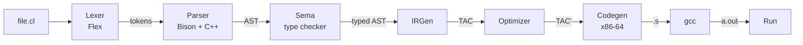
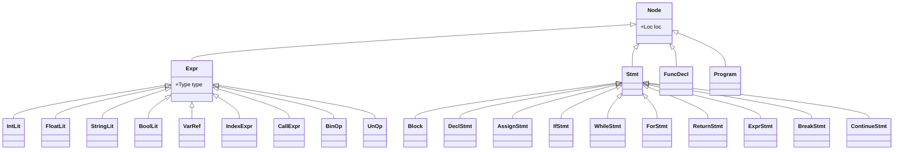

# CSE 430 Compiler Design Lab — Project Report

## competitive-lang: A Mini-Compiler

---

**Course:** CSE 430 — Compiler Design Lab
**Project Type:** Individual
**Language Implemented:** competitive-lang (a C++-flavored language with competitive-programming built-ins)
**Target:** x86-64 Linux assembly (real, executable; assembled and linked with `gcc`)
**Toolchain:** Flex 2.6.4, Bison 3.8.2, g++ 13.3 (C++17), gcc 13.3
**Source line count:** ~2,200 lines C++/Flex/Bison + ~75 lines C runtime

---

## Table of Contents

1. [Introduction](#1-introduction)
2. [Design](#2-design)
   - 2.1 Compiler pipeline
   - 2.2 Language grammar
   - 2.3 Type system
   - 2.4 AST hierarchy
   - 2.5 IR (three-address code)
   - 2.6 Stack-frame layout
3. [Implementation](#3-implementation)
   - 3.1 Lexer (Flex)
   - 3.2 Parser + AST construction (Bison + C++)
   - 3.3 Semantic analyzer + symbol table
   - 3.4 IR generator
   - 3.5 Optimizer
   - 3.6 Code generator (x86-64)
   - 3.7 Runtime library
   - 3.8 Driver / CLI
4. [Results](#4-results)
   - 4.1 End-to-end walkthrough: `fib.cl`
   - 4.2 Sort + binary search
   - 4.3 Optimizer before/after
   - 4.4 Error reporting
   - 4.5 Test suite
5. [Limitations and Future Work](#5-limitations-and-future-work)
6. [References](#6-references)

---

## 1. Introduction

### 1.1 Project overview

This project implements a complete six-phase mini-compiler for a programming language called **competitive-lang**. The compiler reads source files with a `.cl` extension and produces a native x86-64 Linux executable that can be run directly. Along the way it dumps the output of every classical compiler phase — tokens, AST, intermediate representation (IR), optimized IR, and assembly — through dedicated CLI flags.

### 1.2 Language motivation

competitive-lang has the surface syntax of C/C++ — `int main() { ... }`, `if`/`else`, `while`, `for`, arrays — combined with first-class built-in functions inspired by competitive programming workflows: `sort`, `binary_search`, `reverse`, `gcd`, `lcm`, `min`/`max`/`abs`, `swap`, `len`, `read`/`print`, plus first-class string variables with `+` (concat), `==`, and `len`. The result lets you write a "read N, sort, binary search" snippet in 10 lines — close to the experience of a competitive-programming language with the rigor of C.

### 1.3 Tools used

| Component | Tool / Standard |
|---|---|
| Lexical analysis | Flex 2.6.4 |
| Syntax analysis  | GNU Bison 3.8.2 (LALR(1)) |
| Driver / passes  | g++ 13.3 with C++17 |
| Runtime library  | gcc (C) |
| Target ABI       | System V AMD64 (Linux x86-64) |
| Assembler / linker | `gcc` driver with `as` and `ld` (GAS Intel syntax) |

---

## 2. Design

### 2.1 Compiler pipeline



Every arrow corresponds to an in-memory data structure passed between passes; every box is an actual C++ class or `.l` / `.y` file in `src/`.

### 2.2 Language grammar (BNF, LALR(1))

```ebnf
program     ::= func_decl+

func_decl   ::= type IDENT '(' params? ')' block

type        ::= 'int' | 'float' | 'string' | 'bool'

params      ::= param (',' param)*
param       ::= type IDENT

block       ::= '{' stmt* '}'

stmt        ::= decl_stmt | assign_stmt | if_stmt | while_stmt
              | for_stmt  | return_stmt | expr_stmt | block
              | 'break' ';' | 'continue' ';'

decl_stmt   ::= type IDENT ('=' expr)? ';'
              | type IDENT '[' INT_LIT ']' ';'

assign_stmt ::= lvalue ('=' | '+=' | '-=') expr ';'
lvalue      ::= IDENT | IDENT '[' expr ']'

if_stmt     ::= 'if' '(' expr ')' stmt
              | 'if' '(' expr ')' stmt 'else' stmt
while_stmt  ::= 'while' '(' expr ')' stmt
for_stmt    ::= 'for' '(' for_init expr ';' assign_no_semi ')' stmt
for_init    ::= decl_stmt | assign_stmt | ';'

expr        ::= INT_LIT | FLOAT_LIT | STRING_LIT | 'true' | 'false'
              | IDENT | IDENT '[' expr ']' | IDENT '(' args? ')'
              | '(' expr ')'
              | expr binop expr | unop expr
```

**Operator precedence** (low → high): `||` < `&&` < `== !=` < `< <= > >=` < `+ -` < `* / %` < `! unary-`. Dangling-else is resolved by Bison's `%nonassoc LOWER_THAN_ELSE` + `%nonassoc ELSE`, attaching `else` to the nearest `if`.

### 2.3 Type system

| Type      | Width   | Notes |
|-----------|---------|-------|
| `int`     | 8 bytes | 64-bit signed (i64) |
| `float`   | 8 bytes | IEEE 754 double (f64), held in xmm registers |
| `bool`    | 8 bytes (slot) | logically 0 or 1 |
| `string`  | 256 bytes (local), pointer (literal) | inline buffer for locals; immutable .rodata for literals |
| `T[N]`    | N×8 bytes inline | `int[100]` only in v1 |

Rules in summary:

- No implicit numeric coercions: `int + float` is an error.
- `if`/`while`/`for` conditions must be `bool`.
- `==`/`!=` work on any same-type pair (numeric, string, bool).
- `+` is overloaded for numerics and strings (concat); other arith ops are numeric only.
- All paths in a non-void function must return.

### 2.4 AST hierarchy



Each node owns its children with `std::unique_ptr`. Every concrete pass (sema, IR generator, AST printer) is implemented as a `Visitor` subclass — the double-dispatch lets new passes be added without touching the AST.

### 2.5 IR (three-address code)

The IR is a flat sequence of `Instr` records per function. Each instruction has a destination operand, two source operands, and an opcode from a fixed set:

| Class | Opcodes |
|---|---|
| Binary arith | `ADD SUB MUL DIV MOD` |
| Comparison   | `EQ NEQ LT LE GT GE` |
| Logical      | `AND OR NOT NEG` |
| Move         | `COPY` |
| Memory       | `LOAD` (`dst = base[idx]`), `STORE` (`base[idx] = src`), `ADDR` (`dst = &name`) |
| Control flow | `LABEL JMP JZ JNZ` |
| Calls        | `PARAM` (queue arg), `CALL` (`dst = call f, n`), `RET` |

Operands are tagged: `TEMP` (function-local synthetic name), `VAR` (named source variable), `INT_CONST`, `FLOAT_CONST`, `STR_CONST` (interned in the .rodata pool), `LABEL_REF`, `FUNC_REF`. Every operand carries a `Type` so codegen can dispatch float vs int.

### 2.6 Stack-frame layout

The code generator uses a **stack-machine** discipline — every operand has its own 8-byte stack slot (or 256-byte buffer for string locals, or 8N bytes for int[N] arrays), no register allocator. Operations load into `rax` / `rcx` / `rdx`, compute, and store back.

```js
Caller's frame
[rbp + 24]   stack arg 9   (if any)
[rbp + 16]   stack arg 7   (first stack-passed arg)
[rbp + 8]    return address
[rbp + 0]    saved rbp                 ← rbp points here
─────────────────────────────────────
Callee's frame (FRAME_SIZE bytes total, 16-byte-aligned)
[rbp - 8]    first reg-passed param    ← spilled here on entry
[rbp - 16]   second reg-passed param
   ...
[rbp - K]    locals (each 8 / 256 / 8N bytes)
   ...
[rbp - X]    temps (each 8 bytes)
[rbp - FRAME_SIZE]                      ← rsp after prologue
```

System V AMD64: first 6 int/ptr args in `rdi rsi rdx rcx r8 r9`; first 8 float args in `xmm0..xmm7`; the rest on the stack. `rsp` must be 16-byte aligned at every `call` site.

---

## 3. Implementation

### 3.1 Lexer ([src/lexer.l](../src/lexer.l))

Flex generates a `yylex()` that the Bison parser drives. We track `yylineno` automatically and a manual `yycolumn` (reset on `\n`, advanced by `YY_USER_ACTION`).

```lex
%option noyywrap yylineno never-interactive

#define YY_USER_ACTION                                  \
    yylloc.first_line = yylloc.last_line = yylineno;    \
    yylloc.first_column = yycolumn;                     \
    yylloc.last_column  = yycolumn + yyleng - 1;        \
    yycolumn += yyleng;

"if"        { return IF; }
"int"       { return INT_KW; }
"=="        { return EQ; }
[0-9]+\.[0-9]+   { yylval.fval = atof(yytext); return FLOAT_LIT; }
[0-9]+           { yylval.ival = atoll(yytext); return INT_LIT; }
\"([^"\\\n]|\\.)*\"  {
    yylval.sval = dup_string_lit(yytext, yyleng);
    return STRING_LIT;
}
[A-Za-z_][A-Za-z0-9_]* { yylval.sval = strdup(yytext); return IDENT; }
```

Comments (`//` and `/* */`) and whitespace are skipped silently. String literals are unescaped at lex time (`\n` → newline, `\"` → `"`, etc.).

### 3.2 Parser + AST construction ([src/parser.y](../src/parser.y), [src/ast.hpp](../src/ast.hpp))

The Bison grammar uses `%locations` and a `%union` containing pointers to AST nodes; each rule's action `new`s a node and immediately wraps its children in `std::unique_ptr`.

```yacc
expr
    : expr PLUS expr {
        auto* e = new BinOp();
        e->op  = BinOp::Add;
        e->lhs.reset($1);
        e->rhs.reset($3);
        e->loc = locOf(@1);
        $$ = e;
      }
    | IDENT LPAREN args_opt RPAREN {
        auto* e = new CallExpr();
        e->callee = $1; free($1);
        if ($3) { e->args = std::move(*$3); delete $3; }
        e->loc = locOf(@1);
        $$ = e;
      }
    ;
```

Operator precedence is encoded with `%left` / `%right` directives in the grammar prologue, and dangling-else is resolved by a `%prec LOWER_THAN_ELSE` marker on the unmatched-`if` rule. The grammar produces zero shift-reduce or reduce-reduce conflicts.

### 3.3 Semantic analyzer + symbol table ([src/sema.cpp](../src/sema.cpp), [src/symtab.cpp](../src/symtab.cpp))

`SymbolTable` holds a stack of `Scope`s (hashmap + parent pointer); scopes are kept alive after exit so AST nodes can keep `Symbol*` pointers into them. Functions live in a separate flat global namespace.

The analyzer is a `Visitor` that:

1. Pre-installs the 13 built-in functions (`print read sort reverse binary_search gcd lcm max min abs swap len`).
2. Pre-declares each user function so calls can resolve forward references.
3. Walks each function body, type-checking and resolving identifiers.

```cpp
void visit(BinOp& n) override {
    n.lhs->accept(*this); n.rhs->accept(*this);
    Type lt = n.lhs->type, rt = n.rhs->type;
    if (lt.isError() || rt.isError()) { n.type = tyError(); return; }

    switch (n.op) {
      case BinOp::Add:
        if (lt.kind == Type::STRING && rt.kind == Type::STRING) n.type = tyStr();
        else if (lt.isNumeric() && rt.isNumeric() && lt == rt)  n.type = lt;
        else { error(n.loc, "operator + needs same numeric type or strings"); n.type = tyError(); }
        return;
      case BinOp::Lt: case BinOp::Le: case BinOp::Gt: case BinOp::Ge:
        if (lt.isNumeric() && rt.isNumeric() && lt == rt) n.type = tyBool();
        else { error(n.loc, "comparison requires numeric operands of same type"); n.type = tyError(); }
        return;
      // ...
    }
}
```

Errors accumulate in a counter; the analyzer continues so users see all problems in one pass. A recursive `endsInReturn(Stmt*)` walk verifies that every path in a non-void function ends in `return`.

### 3.4 IR generator ([src/irgen.cpp](../src/irgen.cpp))

The IR generator is another `Visitor`. Expression visitors return their result through a member `Operand resultExpr`; statement visitors emit instructions. Fresh temps and labels come from per-function counters.

```cpp
void visit(IfStmt& n) override {
    Operand cond = genExpr(n.cond.get());
    if (n.elseS) {
        std::string Lelse = curFunc->newLabel("Lelse");
        std::string Lend  = curFunc->newLabel("Lend");
        emit(Op::JZ, Operand::none(), cond, Operand::label(Lelse), n.loc);
        n.thenS->accept(*this);
        emit(Op::JMP, Operand::none(), Operand::label(Lend), Operand::none(), n.loc);
        emit(Op::LABEL, Operand::none(), Operand::label(Lelse), Operand::none(), n.loc);
        n.elseS->accept(*this);
        emit(Op::LABEL, Operand::none(), Operand::label(Lend), Operand::none(), n.loc);
    } else {
        std::string Lend = curFunc->newLabel("Lend");
        emit(Op::JZ, Operand::none(), cond, Operand::label(Lend), n.loc);
        n.thenS->accept(*this);
        emit(Op::LABEL, Operand::none(), Operand::label(Lend), Operand::none(), n.loc);
    }
}
```

Built-in calls are *monomorphized* at this stage based on argument types: `print(int)` becomes a call to `__rt_print_int`; `print(float)` → `__rt_print_float`; `sort(int[],int)` → `__rt_sort_int`. Built-ins that take lvalues (`read`, `swap`, `sort` array arg) emit `ADDR` to obtain a pointer. `len(arr)` is folded to a compile-time constant from the array's declared length. String `+` and `==` are lowered to runtime calls (`__rt_strconcat`, `__rt_streq`) at IR time.

### 3.5 Optimizer ([src/opt.cpp](../src/opt.cpp))

Three small passes are run to a fixed point per function:

1. **Constant folding + algebraic identities**: if both sources of a binary op are constants the result is computed at compile time and the instruction becomes a `COPY` of that constant. Identities like `x+0→x`, `x*1→x`, `x*0→0`, `x-x→0`, `x/1→x` are also applied.
2. **Intra-block constant propagation**: within a basic block (separated by `LABEL`s), uses of a temp known to hold a constant are replaced with the constant itself.
3. **Dead-code elimination**: pure instructions whose destination temp is never used are deleted. Side-effecting opcodes (`CALL`, `STORE`, `RET`, jumps) are preserved.

```cpp
if (isIntC(i.src1) && isIntC(i.src2)) {
    long long a = i.src1.ival, b = i.src2.ival;
    switch (i.op) {
        case Op::ADD: makeCopy(i, Operand::intC(a + b)); changed = true; continue;
        case Op::MUL: makeCopy(i, Operand::intC(a * b)); changed = true; continue;
        case Op::LT:  makeCopy(i, Operand::boolC(a <  b)); changed = true; continue;
        // ...
    }
}
```

Out of scope (and explicitly stated as future work): common subexpression elimination, loop-invariant code motion, SSA, register allocation.

### 3.6 Code generator ([src/codegen.cpp](../src/codegen.cpp))

Codegen emits GAS Intel-syntax x86-64 directly. For each function:

1. **Frame layout pre-pass**: assign every named operand (params, locals, temps) a stack slot relative to `rbp`. Round the total frame size up to a multiple of 16 to keep `rsp` aligned at every `call` site.
2. **Prologue**: `push rbp; mov rbp, rsp; sub rsp, FRAME_SIZE`. Spill register-passed params into their slots immediately.
3. **Lower each TAC instruction** mechanically.
4. **Epilogue**: `mov rsp, rbp; pop rbp; ret`.

Lowering is purely table-driven. Examples:

```asm
; t = a + b   (int)
mov  rax, [rbp - A_OFF]
mov  rcx, [rbp - B_OFF]
add  rax, rcx
mov  [rbp - T_OFF], rax

; t = a < b   (int)
mov  rax, [rbp - A_OFF]
cmp  rax, [rbp - B_OFF]
setl al
movzx rax, al
mov  [rbp - T_OFF], rax

; t = arr[i]  (LOAD)
mov  rcx, [rbp - I_OFF]
lea  rax, [rbp - ARR_OFF]
mov  rax, [rax + rcx*8]
mov  [rbp - T_OFF], rax
```

Function calls follow the System V ABI exactly: classify each queued `PARAM` as int-class or float-class; load the first 6 ints into `rdi rsi rdx rcx r8 r9`, the first 8 floats into `xmm0..xmm7`; push the rest onto the stack with appropriate alignment padding; set `al` to the number of xmm args used (required for variadic targets like `printf`); emit `call name@PLT` for external symbols (libc and our `__rt_*` runtime), plain `call name` for in-module functions.

For floats, codegen uses `xmm0`/`xmm1` as scratch and instructions `addsd subsd mulsd divsd ucomisd`. Float comparisons map to unsigned `setb/setbe/seta/setae` because `ucomisd` exposes flags through CF.

For string variables, the slot itself is a 256-byte buffer; "loading" a string operand emits `lea rax, [rbp - off]` (the buffer's address). Assigning a string is a runtime `strcpy@PLT` rather than a value move, since the source is some other pointer to a buffer or a `.rodata` literal.

### 3.7 Runtime library ([src/runtime.c](../src/runtime.c))

A small C file shipped with the compiler and linked into every output executable. ~75 lines of straightforward C calling `printf`/`scanf`/`qsort`/`strcpy`/`strcmp`.

```c
void __rt_print_int(long long x)        { printf("%lld\n", x); }
long long __rt_read_int(void)           { long long x; if (scanf("%lld", &x) != 1) x = 0; return x; }
static int __rt_cmp_ll(const void* a, const void* b) {
    long long x = *(const long long*)a, y = *(const long long*)b;
    return (x > y) - (x < y);
}
void __rt_sort_int(long long* a, long long n)            { if (n > 1) qsort(a, n, 8, __rt_cmp_ll); }
long long __rt_binary_search_int(long long* a, long long n, long long key) {
    long long lo = 0, hi = n;
    while (lo < hi) { long long m = (lo + hi) / 2; if (a[m] < key) lo = m + 1; else hi = m; }
    return (lo < n && a[lo] == key) ? lo : -1;
}
long long __rt_gcd(long long a, long long b) {
    if (a<0) a=-a; if (b<0) b=-b;
    while (b) { long long t=a%b; a=b; b=t; }
    return a;
}
```

### 3.8 Driver / CLI ([src/main.cpp](../src/main.cpp))

The driver chains the passes and exposes per-phase flags. Default action: write asm to a temp file, then invoke `gcc -no-pie out.s runtime.o -o a.out`.

```bash
cpc [flags] FILE
  --tokens   --ast   --ir   --opt-ir   -S   -o NAME
```

---

## 4. Results

### 4.1 End-to-end walkthrough: `fib.cl`

The input source:

```cpp
int fib(int n) {
    if (n < 2) { return n; }
    return fib(n - 1) + fib(n - 2);
}

int main() {
    int n;
    read(n);
    print(fib(n));
    return 0;
}
```

**Tokens** (`cpc --tokens fib.cl`, abridged):

```bash
  2:1    INT          int
  2:5    IDENT        fib
  2:8    LPAREN       (
  2:9    INT          int
  2:13   IDENT        n
  2:14   RPAREN       )
  3:5    IF           if
  3:9    IDENT        n
  3:11   LT           <
  3:13   INT_LIT      2
  ...
```

**AST** (`cpc --ast fib.cl`, abridged):

```bash
Program
  FuncDecl fib -> int
    Param n : int
    Block
      IfStmt
        cond:  BinOp <
                 VarRef n
                 IntLit 2
        then:  Block
                 ReturnStmt
                   VarRef n
      ReturnStmt
        BinOp +
          CallExpr fib
            BinOp -
              VarRef n
              IntLit 1
          CallExpr fib
            BinOp -
              VarRef n
              IntLit 2
  FuncDecl main -> int
    Block
      DeclStmt n : int
      ExprStmt
        CallExpr read
          VarRef n
      ExprStmt
        CallExpr print
          CallExpr fib
            VarRef n
      ReturnStmt
        IntLit 0
```

**IR** (`cpc --ir fib.cl`):

```js
function fib(n: int) -> int {
    t0 = n < 2
    jz t0, Lend0
    ret n
Lend0:
    t1 = n - 1
    param t1
    t2 = call fib, 1
    t3 = n - 2
    param t3
    t4 = call fib, 1
    t5 = t2 + t4
    ret t5
}

function main() -> int {
    t0 = call __rt_read_int, 0
    n = t0
    param n
    t1 = call fib, 1
    param t1
    call __rt_print_int, 1
    ret 0
}
```

Note the monomorphization: `read(n)` (where `n: int`) becomes `call __rt_read_int`, and `print(fib(n))` becomes `call __rt_print_int`.

**Assembly** (`cpc -S fib.cl`, head):

```bash
.intel_syntax noprefix
.section .note.GNU-stack,"",@progbits
.text
.globl fib
fib:
    push rbp
    mov rbp, rsp
    sub rsp, 64
    mov [rbp - 8], rdi
    mov rax, [rbp - 8]
    mov rcx, 2
    cmp rax, rcx
    setl al
    movzx rax, al
    mov [rbp - 16], rax
    mov rax, [rbp - 16]
    test rax, rax
    jz .Lend0
    mov rax, [rbp - 8]
    mov rsp, rbp
    ...
```

**Run**:

```bash
$ ./cpc examples/fib.cl -o fib
$ echo 15 | ./fib
610
```

### 4.2 Sort + binary search

```cpp
int main() {
    int n;
    read(n);
    int a[100];
    for (int i = 0; i < n; i = i + 1) {
        read(a[i]);
    }
    sort(a, n);
    print("sorted:");
    for (int i = 0; i < n; i = i + 1) {
        print(a[i]);
    }
    int q;
    read(q);
    int idx = binary_search(a, n, q);
    if (idx >= 0) { print("found at index"); print(idx); }
    else          { print("not found"); }
    return 0;
}
```

```bash
$ ./cpc examples/sort_search.cl -o ss
$ echo "5 3 1 4 1 5 4" | ./ss
sorted:
1
1
3
4
5
found at index
3
```

### 4.3 Optimizer before / after

The same source file (`examples/optimization_demo.cl`):

```cpp
int main() {
    int x = 2 * 3 + 4;   // pure constant
    int y = x * 1 + 0;   // identities
    int z = x - x;       // identity (zero)
    int q;
    read(q);
    int r = q * 0;       // identity (zero)
    print(x); print(y); print(z); print(r);
    return 0;
}
```

**Before optimization** (`--ir`), abridged:

```js
function main() -> int {
    t0 = 2 * 3
    t1 = t0 + 4
    x = t1
    t2 = x * 1
    t3 = t2 + 0
    y = t3
    t4 = x - x
    z = t4
    t5 = call __rt_read_int, 0
    q = t5
    t6 = q * 0
    r = t6
    ...
}
```

**After optimization** (`--opt-ir`):

```bash
function main() -> int {
    x = 10        ; 2*3+4 folded
    t2 = x        ; x*1 → x
    t3 = t2       ; t2+0 → t2
    y = t3
    z = 0         ; x-x → 0
    t5 = call __rt_read_int, 0
    q = t5
    r = 0         ; q*0 → 0
    ...
}
```

The `t0 t1 t4 t6` chain that computed the folded values is gone (DCE). At runtime the program prints `10 10 0 0` regardless of the input value, demonstrating that `q*0` was correctly recognized as zero independent of `q`'s runtime value.

### 4.4 Error reporting

competitive-lang reports semantic errors with line and column numbers and continues to surface every problem in one pass:

```bash
$ ./cpc --ir bad.cl
3:5: error: initializer type int does not match declared type bool
4:9: error: if condition must be bool, got int
5:13: error: unknown function 'unknown'
6:5: error: return type mismatch: expected int, got string
cpc: 4 semantic error(s)
```

### 4.5 Test suite

`make test` runs eight end-to-end programs that compile, link, and execute under a runner that diffs against expected output:

```bash
PASS builtins
PASS control_flow
PASS factorial
PASS fib
PASS gcd
PASS hello
PASS sort_search
PASS strings

------
passed: 8    failed: 0
```

The tests cover: hello world, recursion, all looping forms, the full built-in suite, arrays + sort + binary_search, and string variables (`+`, `==`, `len`, `read`).

---

## 5. Limitations and Future Work

The compiler implements a working, end-to-end x86-64 toolchain, but several features were deliberately deferred for future work:

- **Dynamic arrays / `push_back`.** Static arrays only in v1; `len(arr)` is therefore a compile-time constant. A future `vec<T>` would require a heap-backed runtime with growth strategy and ownership semantics.
- **String / array parameters.** Only locals can be strings or arrays. Adding param support requires distinguishing pointer-passed buffers from inline buffers in the codegen.
- **Register allocation.** All operands live in stack slots and are loaded into `rax`/`rcx`/`rdx` per use. A linear-scan or graph-coloring allocator would substantially reduce code size and improve performance.
- **Optimizer scope.** Only constant folding, intra-block constant propagation, algebraic identities, and pure-temp DCE. Cross-block / loop optimizations (CSE, LICM, SSA-based transforms) are out of scope.
- **Multi-file compilation / modules.** One source file in, one binary out.

These limitations are pedagogically defensible: the v1 compiler shows every classical phase end-to-end with real x86-64 output, which is the project's central goal.

---

## 6. References

1. Aho, Lam, Sethi, Ullman. *Compilers: Principles, Techniques, and Tools* (2nd ed). Addison-Wesley, 2007. (a.k.a. "The Dragon Book") — referenced throughout for grammar design, IR, optimization, and codegen patterns.
2. *Flex Manual* — <https://westes.github.io/flex/manual/>
3. *GNU Bison Manual* (3.8) — <https://www.gnu.org/software/bison/manual/>
4. Matz, Hubička, Jaeger, Mitchell. *System V Application Binary Interface, AMD64 Architecture Processor Supplement, Version 1.0* — <https://gitlab.com/x86-psABIs/x86-64-ABI>
5. *GNU Assembler (GAS) Manual* — <https://sourceware.org/binutils/docs/as/>
